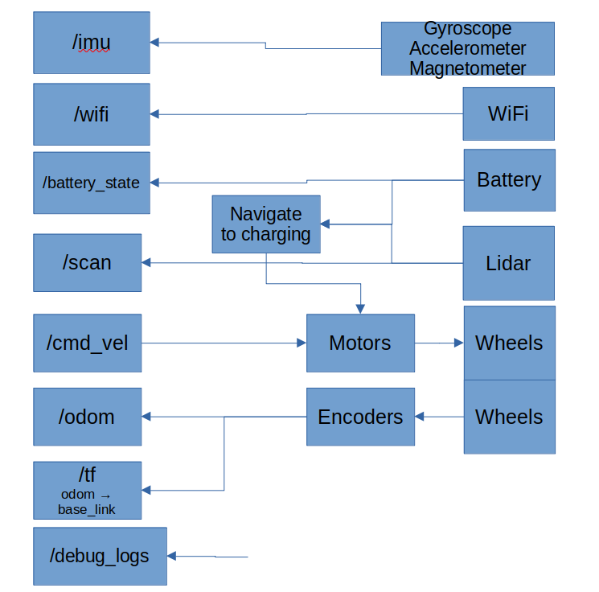
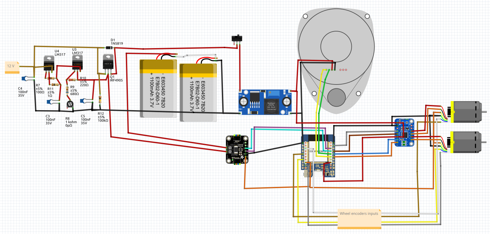

# OVERVIEW

This is a micro-ROS ESP32 program to:

* subscribe to cmd_vel
* drive two motors (DiffDrive) with PID, using their wheel encoders
* read the lidar LDROBOT LD19 and publish /scan
* publish /odom and the odom to base_link transformation on /tf
* publish /wifi with SSID, BSSID and RSSI
* publish /imu
* publish /battery_state: voltage and current
* publish /debug_logs
* go to the docking-charging station when the battery is low

This program, compared with https://github.com/guido57/uros_enc_LD19_arduino, can work even without WiFi, but in this case publishing to ROS2 is obviously precluded.

# SOFTWARE ARCHITECTURE

# SCHEMATIC

  
